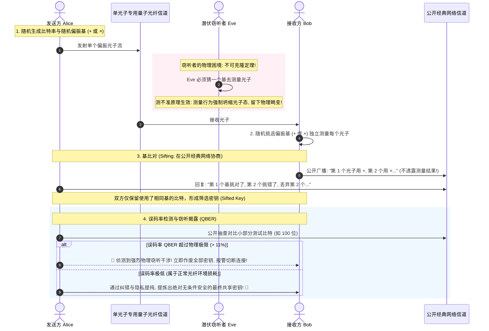
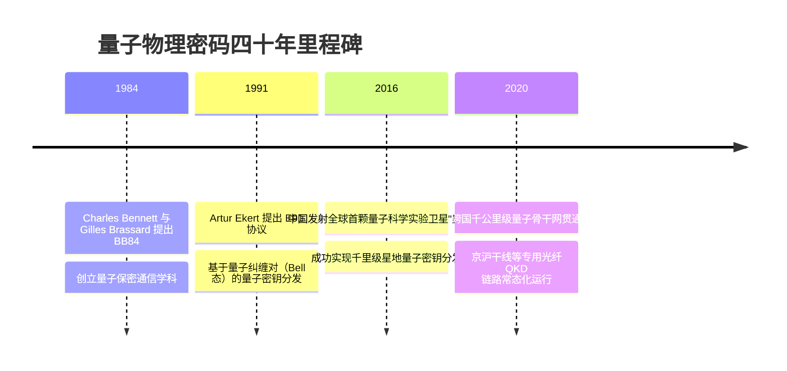

# 量子物理密码 (BB84 QKD 与量子真随机数 QRNG) 🔬

## 1. 概述（What）

与依靠复杂数学难题的后量子密码（PQC）不同，**量子物理密码学（Quantum Cryptography）** 是一种**直接依据量子力学基本物理定律（海森堡测不准原理 Heisenberg Uncertainty Principle 与单量子态不可克隆定理 No-Cloning Theorem）**构建的安全防护体系。其最主要代表为 **BB84 量子密钥分发（Quantum Key Distribution, QKD）** 与 **量子随机数发生器（Quantum Random Number Generator, QRNG）**。

- **核心解决问题**：实现"通信链路中只要有任何第三方中间人尝试窃听，物理规律保证该窃听行为必然破坏光子量子叠加态并瞬间被收发双方察觉"的**无条件信息论物理安全性（Information-theoretic Security）**。
- **典型应用场景**：政府与军方点对点绝密专线通信、跨大洲卫星量子保密通信（如中国"墨子号"量子卫星）、金融结算核心骨干专网。

---

## 2. 原理详解（How it works）

### BB84 协议工作原理与窃听必被捕获机理（Bennett & Brassard, 1984）
BB84 协议利用单光子的偏振状态来编码二进制比特 0 和 1：
- **直线基（Rectilinear Basis, $+$）**：$0^\circ$ 偏振代表比特 0，$90^\circ$ 偏振代表比特 1；
- **对角基（Diagonal Basis, $\times$）**：$45^\circ$ 偏振代表比特 0，$135^\circ$ 偏振代表比特 1。

图 11-7：BB84 单光子量子偏振密钥分发与窃听物理捕获时序图

---

### 量子随机数发生器（QRNG）
计算机软件中的伪随机数（PRNG）无论算法多么复杂，底层均由确定性的数学种子公式计算而来，理论上存在被预测推导的可能。  
**QRNG（如单光子通过半透半反镜的路径选择、真空量子涨落探测）** 的本质是微观世界真正的物理固有不可预测性，是现代顶级密码模块最神圣的真正纯净物理熵源。

---

## 3. 协议与标准（Protocols & Standards）

| 规范体系 | 机构 | 年份 | 关键定位 |
| :--- | :--- | :--- | :--- |
| **ETSI GS QKD 系列标准** [1] | 欧洲电信标准协会 (ETSI) | 现行系列 | QKD 光学组件接口、模块安全要求与部署标准 |
| **ITU-T Y.3800 系列** [2] | 国际电信联盟 (ITU-T) | 2019+ | 量子密钥分发网络的体系架构与安全框架 |
| **ISO/IEC 23837** [3] | ISO/IEC | 2023 | 量子密钥分发安全要求、测试与评估方法 |

---

## 4. 发展历史（Timeline）

图 11-8：量子物理密码技术突破演变历史

---

## 5. 优缺点与安全性分析

### 物理优越性
- **信息论可证明安全性（Information-theoretic Security）**：安全性建立在爱因斯坦相对论与量子力学之上，不受算力发展极限的影响，即使面对未来一百万年后的任何科技也绝无法在物理上传输阶段被未察觉窃听。

### 工程局限与现实困境
1. **物理距离衰减与不可中继**：光子在普通单模光纤中传输约 100 公里后信号严重衰减。由于量子不可克隆，不能使用传统的经典放大器（Amplifier）放大信号，长途传输必须依赖"可信中继节点（Trusted Relays）"，而在中继节点内密钥必须落地，破坏了纯粹的端到端。
2. **硬件极其昂贵，无法装进普通手机**：单光子探测器与高精度雪崩光电二极管体积庞大、需深冷制冷，难以普及到消费级终端。
3. **当前推荐状态**：国防军工与金融骨干专网的物理特种利器；大众互联网端到端加密应主要采用 **PQC 数学软件算法**。

---

## 6. 关联知识点（Related）

- **数学路线对照**：[后量子密码学 PQC 标准化](./02-pqc-standards)。
- **密钥终极应用**：[对称加密 AES-256](/02-data-protection/01-symmetric-encryption)（利用 QKD 分发的密钥作为一次一密 One-Time Pad 或 AES 密钥）。

---

## 7. 参考资料（References）

[1] ETSI. Quantum Key Distribution (QKD); Components and Internal Interfaces.  
https://www.etsi.org/technologies/quantum-key-distribution

[2] ITU-T. Recommendation Y.3800: Overview on networks supporting quantum key distribution.  
https://www.itu.int/rec/T-REC-Y.3800

[3] Charles H. Bennett and Gilles Brassard. Quantum cryptography: Public key distribution and coin tossing.  
https://doi.org/10.1016/j.tcs.2014.05.025
