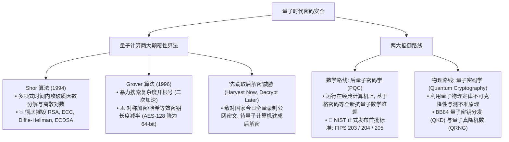

# 十一、量子计算与后量子密码（Quantum & PQC）体系概览 ⚛️

> **后量子密码学（Post-Quantum Cryptography, PQC）与量子安全** 代表了现代密码学近半个世纪以来最深远的一次历史性技术大迁移。当实用化通用量子计算机到来时，现行支撑全球互联网金融、HTTPS 与国防通信的非对称密码（RSA、ECC）将在物理层面被瞬间化解。

---

## 🗺️ 量子安全全景图谱

图 11-1：量子计算对现代密码学的冲击与两大防御演进路线

---

## 📑 本章节知识点索引

| 知识点 | 核心算法 / 规范 | 核心机理与战略意义 | 探索状态 |
| :--- | :--- | :--- | :--- |
| [1. 量子威胁与"先窃后解"威胁模型](./01-quantum-threats) | Shor 算法, Grover 算法, SNDL | 非对称算法崩塌危机、十年保密期军事与商业机密威胁 | 紧迫现实威胁 |
| [2. 后量子密码学 PQC 标准化](./02-pqc-standards) | NIST FIPS 203 (ML-KEM), FIPS 204 (ML-DSA) | 格密码学（Lattice-based）、经典与 PQC 混合过渡部署 | 现役首选迁移路线 |
| [3. 量子物理密码 (BB84 QKD 与 QRNG)](./03-qkd-qrng) | BB84 协议, 单光子偏振, TRNG | 海森堡测不准原理、窃听必被发现、物理级真随机熵源 | 物理前沿标杆 |
